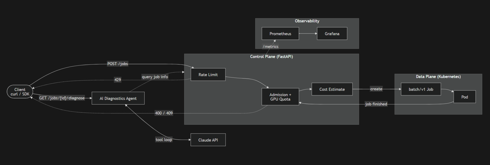
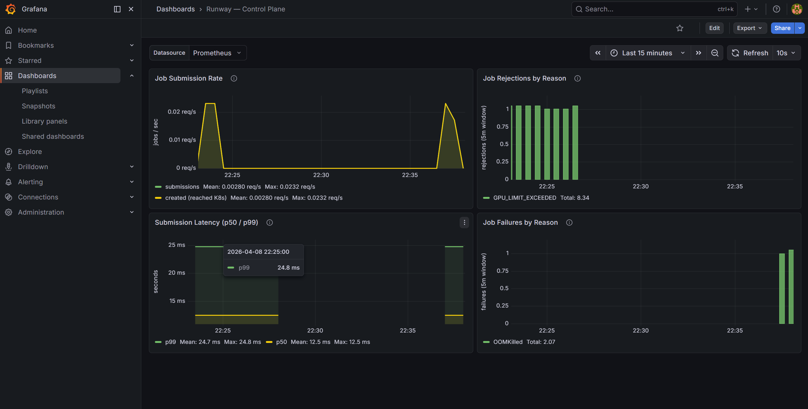

# Runway 🛫

Runway is a Kubernetes-native, AI-infrastructure-aware control plane that validates, rate-limits, and cost-estimates batch and ML workloads before submitting them to a shared cluster.

It enforces GPU quotas, runtime caps, and resource bounds to prevent runaway training jobs and GPU starvation, while remaining minimal, Kubernetes-native, and production-inspired.

---

## What Runway Is

Runway is an **internal infrastructure service**, not an end-user product.

It provides:

- A REST API for submitting batch and ML workloads
- API-layer admission control (CPU, memory, GPU, timeout)
- Per-tenant GPU quota enforcement
- Pre-execution cost estimation
- Kubernetes-native retry semantics
- Prometheus-compatible observability
- AI-backed job diagnostics via Claude API tool use

Execution is fully delegated to Kubernetes Jobs.  
Runway does **not** implement a scheduler, queue, or workflow engine.

---

## Architecture Overview

Runway follows a strict **control-plane / data-plane separation**.



### Control Plane

Client (curl / CLI)  
↓  
Runway Control Plane (FastAPI)

Responsibilities:

- Admission control  
- GPU quota enforcement  
- Rate limiting  
- Cost estimation  
- Kubernetes Job creation  

### Data Plane

Runway delegates execution entirely to Kubernetes (kind locally; EKS in production).

Kubernetes responsibilities:

- Job scheduling  
- Pod execution  
- Resource enforcement (Linux cgroups)  
- Retry semantics (`backoffLimit`)  
- Runtime caps (`activeDeadlineSeconds`)  

### Observability Layer

Prometheus / Grafana

- Metrics collection  
- Failure visibility  
- Latency tracking  
- Health monitoring  



The dashboard surfaces four panels in real time: job submission rate, rejections by reason (GPU quota exceeded, admission violations), submission latency (p50/p99), and job failures by reason (OOMKilled, deadline exceeded).

Kubernetes remains the execution authority.

---

## Job Model

Users submit a minimal `JobSpec`:

- `image`
- `cpu`
- `memory_mb`
- `gpu_count` (optional)
- `timeout_s`
- `tenant_id`
- `command` (optional — overrides Docker `ENTRYPOINT`)
- `args` (optional — overrides Docker `CMD`)

Runway:

1. Validates resource bounds  
2. Enforces GPU quotas  
3. Estimates execution cost  
4. Creates a Kubernetes Job  

Kubernetes is the source of truth for execution state.

---

## AI Diagnostics Agent

`GET /jobs/{id}/diagnose` invokes a Claude-backed agent that investigates why a job failed and returns a plain-language diagnosis with a concrete remediation.

The agent runs a tool-use loop (not a static prompt): Claude decides which tools to call and when it has enough information to stop. Tools available:

| Tool | What it returns |
|---|---|
| `get_job_status` | Current K8s status and `failure_reason` |
| `get_job_spec` | Original resource requests (cpu, memory_mb, gpu_count, timeout_s, image) |

Example output for an OOMKilled job:

> "The job failed because it requested only 32 MB of memory but attempted to allocate 200 MB. Increase `memory_mb` to at least 256 to give the workload sufficient headroom."

Requires `ANTHROPIC_API_KEY` set in the environment.

---

## AI Infrastructure Guardrails

### GPU Quota Enforcement

Prevents a single tenant from consuming all available GPUs in a shared cluster.

- Per-job maximum GPU limit  
- Per-tenant GPU quota (in-memory, v1)  
- Explicit structured rejection  

### Runtime Caps

Prevents runaway ML training workloads.

- Enforced via `activeDeadlineSeconds`  
- Deadline-exceeded failures surfaced clearly  

### Cost Awareness

Provides visibility before expensive workloads run.

Estimated cost:
(cpu * cpu_rate + memory_gb * mem_rate + gpu * gpu_rate) * runtime_hours


- Rates configurable via environment variables  
- Not integrated with AWS billing APIs in v1  

---

## Observability

### Prometheus Metrics

- `jobs_submitted_total`
- `jobs_rejected_total`
- `gpu_quota_rejected_total`
- `rate_limited_total`
- `job_create_failures_total`
- `request_latency_seconds`

Metrics intentionally avoid per-tenant labels in v1 to prevent cardinality issues.

### Logging

Structured logs include:

- `tenant_id`
- `job_id`
- `request_id`
- `estimated_cost`

### Health Checks

- `/healthz` endpoint

---

## Repository Structure

```text
Runway/
├── docs/
│   ├── project_spec.md      # Canonical requirements and scope
│   ├── architecture.md      # System design and rationale
│   ├── features.md          # Feature inventory and behavior
│   ├── project_status.md    # Milestones and progress
│   ├── changelog.md         # Historical changes
│   ├── scale_analysis.md    # Failure modes and v2 design at 10x load
│   ├── grafana_dashboard.json  # Grafana dashboard export
│
├── services/
│   └── runway-api/          # FastAPI control plane
│       ├── main.py          # Routes, app entrypoint, lifespan wiring
│       ├── models.py        # Pydantic request/response schemas
│       ├── admission.py     # Resource bounds validation
│       ├── quota.py         # Per-tenant GPU quota enforcement
│       ├── quota_reconciler.py  # Background async loop — quota release on job completion
│       ├── rate_limit.py    # Per-tenant fixed-window rate limiting
│       ├── cost.py          # Preflight cost estimation
│       ├── k8s_client.py    # Kubernetes Job creation, status, failure reason
│       ├── metrics.py       # Prometheus metrics definitions
│       └── requirements.txt
│
├── k8s/
│   ├── deployment.yaml      # Runway API Deployment + Service
│   └── servicemonitor.yaml  # Prometheus ServiceMonitor
│
├── infra/
│   └── terraform/           # EKS production IaC reference (not active locally)
│
├── CLAUDE.md                # AI collaboration rules and constraints
└── README.md                # Project overview
```

---

### Design principles

- Kubernetes-native primitives over custom orchestration
- Guardrails over flexibility
- Explicit trade-offs over hidden complexity
- Cost visibility before execution
- AI-infrastructure-aware without becoming an ML platform

---

### Status

All functional work complete (v1.0.0).

- Control plane: admission control, GPU quota enforcement, rate limiting, cost estimation, failure reason surfacing
- GPU quota reconciler: background async poll, releases quota on terminal job state
- Observability stack live: Prometheus scraping runway-api (ServiceMonitor), Grafana dashboard with 4 panels
- AI Diagnostics Agent: `GET /jobs/{id}/diagnose` — Claude-backed tool-use loop diagnosing failures and suggesting fixes
- All 5 demo scenarios validated end-to-end on kind: happy path, OOMKilled, GPU quota rejection, rate limit, AI diagnosis
- Runtime target: kind (local); EKS Terraform in `infra/terraform/` as production IaC reference

